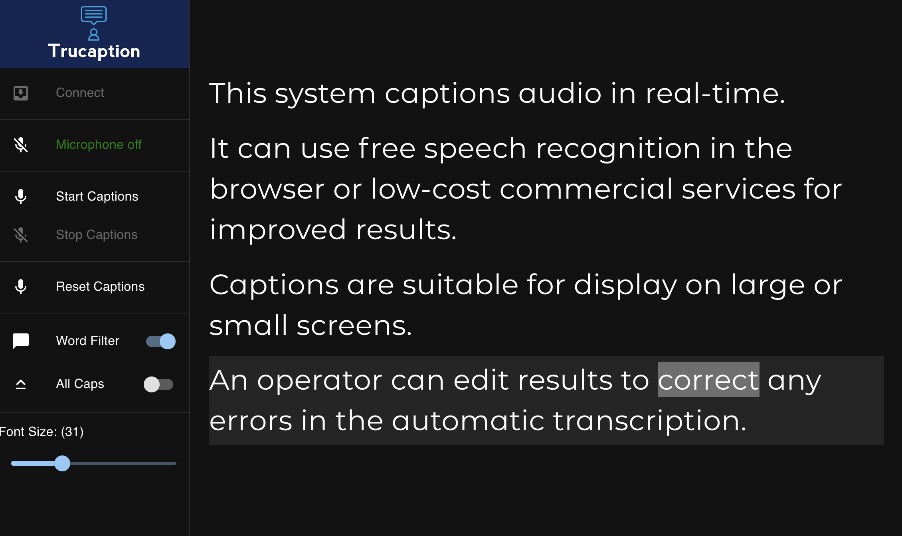
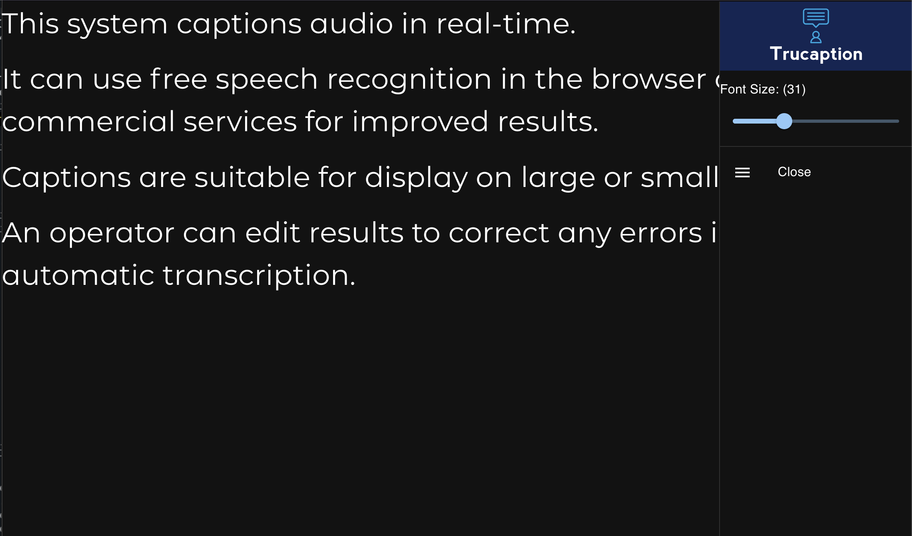
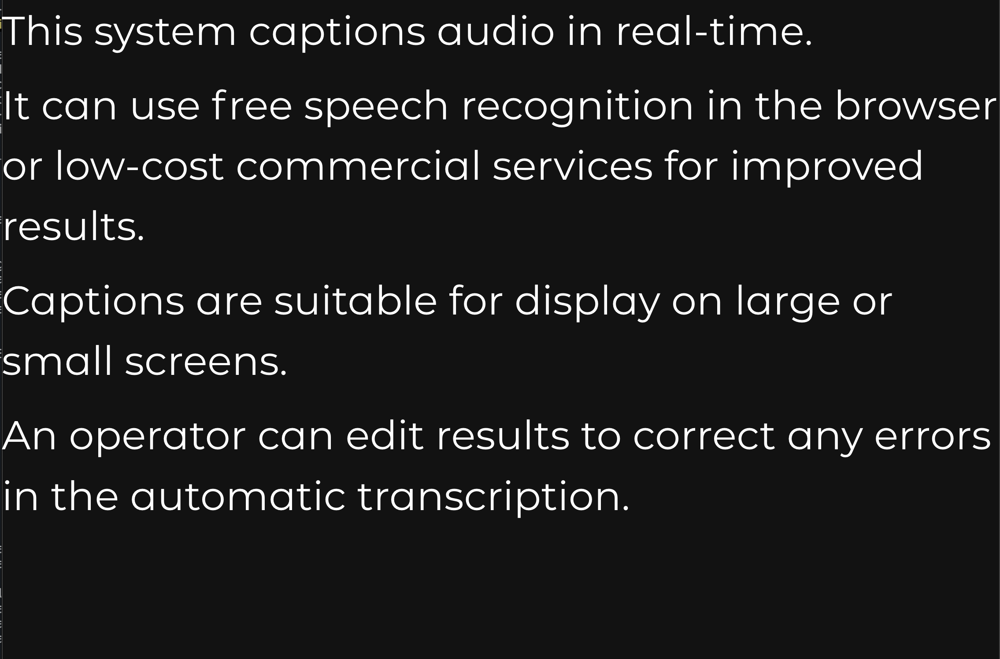

# Trucaption

Trucaption is a Computer-Aided Real Time Transcription (CART) system.

Editor Page:

Viewer (collapsable menu):

Full/big-screen viewer:

## Usage

### Generating Transcripts

1. Open the editor interface (default: http://localhost:8080/).
2. Click "Connect" to initialize the speech recognition service.
3. Click "Start Captions" to start captioning.

### Editing Captions

To correct errors in the auto-generated captions, click on the text. The text 
will then become editable. Make any necessary edits and click outside the
edit box or press Enter; the changes will then be sent to all display screens.

To cancel changes, press Escape.

### Displaying Captions

1. Open the caption viewer (default: http://*caption-host*/). Additional
   parameters can be added to customize the display:
    - http://*caption-host*/?fullscreen will disable the menu and use the 
      default font size
    - http://*caption-host*/?fullscreen&size=40 will disable the menu and 
      set the font size to 40
    - http://*caption-host*/?size=40 will set the starting font size to 40,
      which can then be changed via the menu.

## Supported Transcription Services

By default, Trucaption uses the native speech recognition engine in the web 
browser. Not all browsers support speech recognition natively, and accuracy
may vary from browser to browser.

For improved transcription results and greater browser compatibility, 
Trucaption can be configured to use one of the following services:

- Azure Speech Services
- Speechly

When using the native speech recognition engine or Speechly, All Caps is
automatically enabled because these services return all text in lower case.
All caps can be disabled via the menu on the controller.
